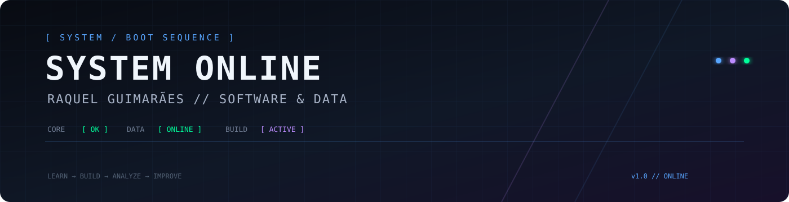

<!-- =========================================================
RAQUEL GUIMARÃES — GITHUB PROFILE
Software Development • Data • Technology
========================================================= -->

<div align="center">



<br><br>


</div>

---

# `> whoami`

```text
╔══════════════════════════════════════════════════════════════╗
║                    DEVELOPER PROFILE                        ║
╠══════════════════════════════════════════════════════════════╣
║ Name       : Raquel Guimarães                               ║
║ Role       : Software Development Student                   ║
║ Focus      : Software • Data • Technology                   ║
║ Learning   : Programming • Databases • Data Analysis        ║
║ Education  : Software Development + MBA in Marketing         ║
║ Mindset    : Learn → Build → Analyze → Improve              ║
╚══════════════════════════════════════════════════════════════╝
```

## 🧠 Sobre Mim

Sou estudante de **Desenvolvimento de Software Multiplataforma**, com foco em **programação, dados, bancos de dados e construção de soluções tecnológicas**.

Tenho interesse em transformar problemas em soluções práticas, explorar dados para encontrar informações relevantes e desenvolver projetos que conectem **tecnologia, análise e negócio**.

Também curso **MBA em Marketing**, que complementa minha formação técnica com uma visão voltada para estratégia, comportamento, negócios e tomada de decisão orientada por dados.

```text
MISSION
────────────────────────────────────────────────────────────
[✓] Learn continuously
[✓] Build real projects
[✓] Strengthen programming fundamentals
[✓] Work with data and databases
[✓] Connect technology with business
[→] Build solutions that create impact
```

---

# `> tech_stack`

<div align="center">

### 💻 Languages


<br><br>

### 🗄️ Data & Databases


<br><br>

### ⚙️ Development & Tools


</div>

---

# `> tools.exe`

<div align="center">


<br>


</div>

---

# `> projects`

<div align="center">

<table>
<tr>
<td width="100%">

### 🏋️ Bot Treino WhatsApp


Projeto voltado ao registro e organização de informações de treinos, com foco em **automação, estruturação de dados e experiência de uso**.

**Repository**

<a href="https://github.com/devraquelguimaraes/bot-treino-whatsapp">

</a>

</td>
</tr>
</table>

</div>

---

# `> current_objectives`

```bash
$ ./raquel --current-mission

[01] ████████████████████░░  Python
[02] █████████████████░░░░░  Data Analysis
[03] █████████████████░░░░░  SQL & Databases
[04] ███████████████░░░░░░░  Power BI
[05] ███████████████░░░░░░░  Software Development
[06] ██████████████░░░░░░░░  Git & GitHub
[07] ████████████░░░░░░░░░░  Portfolio Projects

> next_target: TECHNOLOGY / DATA INTERNSHIP
> system.message: "Keep learning. Keep building."
```

---

# `> github.analytics`

<div align="center">


</div>

<br>

<div align="center">


</div>

---

# `> activity.log`

<div align="center">


</div>

---

# `> achievements`

<div align="center">


</div>

---

# `> contribution.matrix`

<div align="center">


</div>

---

# `> connect`

<div align="center">

<a href="https://www.linkedin.com/in/raqueltodescatto/">

</a>

<a href="mailto:raqueltodescatto@gmail.com">

</a>

<a href="https://github.com/devraquelguimaraes">

</a>

</div>

---

<div align="center">

```text
╭────────────────────────────────────────────────────────────╮
│                                                            │
│       "The future belongs to those who build it."         │
│                                                            │
│                 SYSTEM STATUS: ONLINE                     │
│                 CONNECTION: STABLE                         │
│                 MODE: BUILDING                             │
│                                                            │
╰────────────────────────────────────────────────────────────╯
```


</div>
